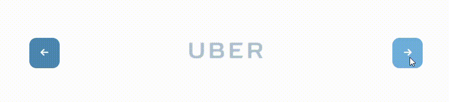

# 🌐 CSSResponsive – Responsive Landing Page UI

> A modern, responsive landing page based on the **Ehya – Designspace Premium UI Kit**

---

## 🎨 Project Overview

This project is a **responsive landing page** created as a CSS/HTML implementation of the **[Ehya Premium UI Kit](https://designspace.io/product/ehya-landing-page-design-template/)** by Designspace.

It was developed to replicate the functionality and style of the original design, using only HTML and CSS (no JavaScript frameworks), focusing on:

- Smooth layout responsiveness  
- Clean, modern visual design  
- Button and hover effects  
- CSS-only animations and transitions  

---

## 🛠️ Tech Stack

| Technology | Purpose |
|------------|---------|
| **HTML5**  | Page structure |
| **CSS3**   | Layout, grid, responsiveness, effects |
| **Flexbox & Grid** | Content alignment and layout |
| **Media Queries** | Mobile-first responsive design |
| **CSS Animations** | Carousel and hover effects |

---

## 🖼️ Screenshots

### 🧩 Full Page Preview

A full scrollable view of the responsive landing page:


---

## ✨ Interactive Features

### 🔁 Carousel – Company Logos

Animated carousel showing logos of popular brands, built with **CSS animation**:



---

### 🔘 Button Hover Effect

Elegant and smooth **button transitions on hover** using `transition` and `transform`:


---

### 🌫️ CSS Shadow Interactions

Dynamic shadows and hover effects enhancing depth and UI feedback:


---

## 📁 Repository

🔗 **GitHub**: [github.com/werAnnOstrowska/CSSResponsive](https://github.com/werAnnOstrowska/CSSResponsive)

---

## 🙌 Credits

- **UI Design**: [Ehya – Designspace Premium UI Kit](https://designspace.io/product/ehya-landing-page-design-template/)
- **Implementation**: Created with ❤️ by [@werAnnOstrowska](https://github.com/werAnnOstrowska)

---

## 📱 Responsive Showcase

This page adapts beautifully across devices:
- ✅ Desktop
- ✅ Tablet
- ✅ Mobile

---

## 📌 How to Use

1. Clone the repo:
   ```bash
   git clone https://github.com/werAnnOstrowska/CSSResponsive.git
